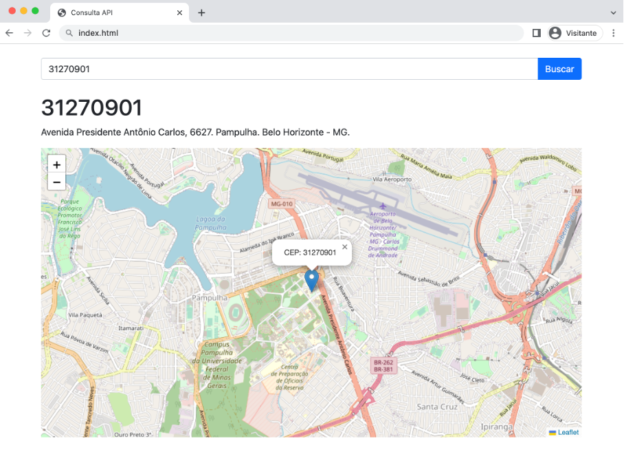

# api_consulta_cep
Este código apresenta uma função usada para realizar consultas de CEP na Brasil API (https://brasilapi.com.br).

As requisições são feitas de forma assíncrona usando o objeto XMLHttpRequest (XHR).

-  *Entrada*: oito dígitos de um CEP
-  *Saída*: Retorna o endereço correspondente em um objeto JSON

## Avançado
    O código inclui ainda uma função para gerar mapas usando a biblioteca <a href="https://leafletjs.com/">Leaflet</a>.

## Exemplo
